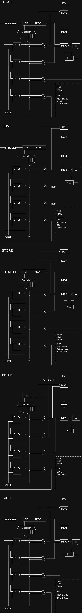
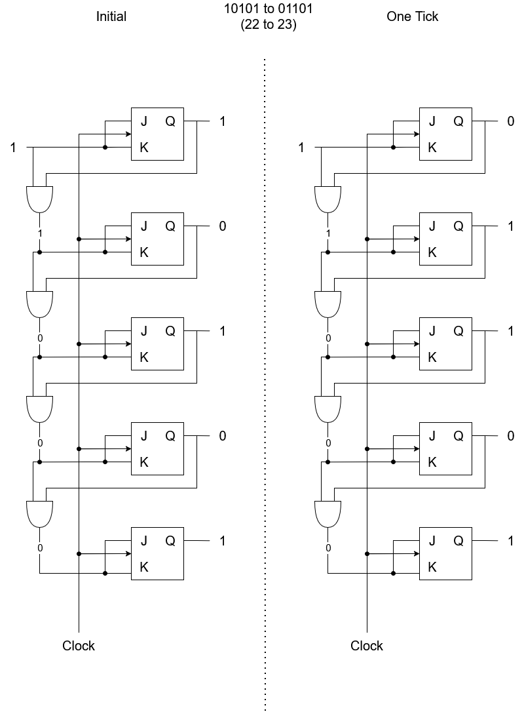

# CGS 3269: Final Examination Prep.

## Table of Contents
* [Control Unit OPs](#control-unit-ops)
* [JK Flip Flops](#jk-flip-flops)

------

## Control Unit OPs

#### "Give the design of the tiny computer architecture including the control unit with the ring counter and show the distribution of the clock ticks that are required to execute the instruction LOAD/ADD/STORE/JUMP/FETCH."

------

## JK Flip Flops

#### "Give a design of a counter using five JK flip/flops. Assuming the counter has the value 10101. Set up the inputs for each JK and show what the value will be after one clock tick."

